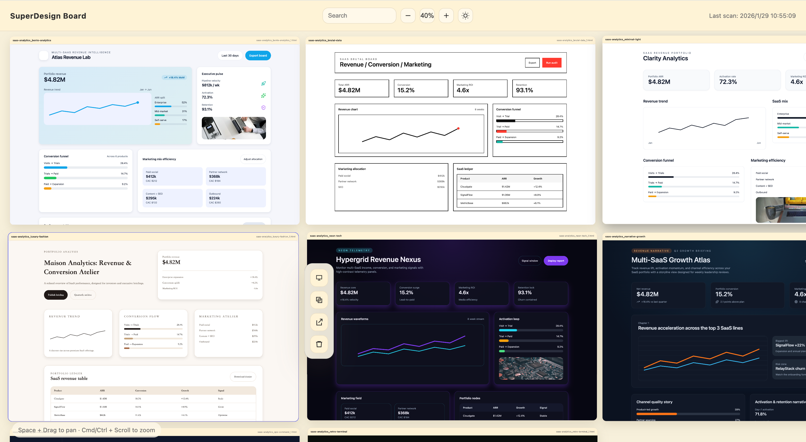
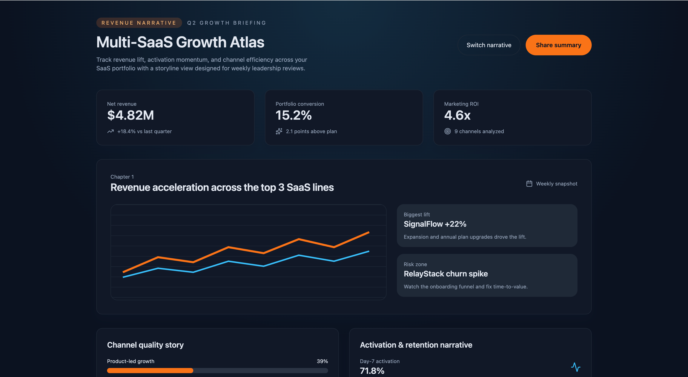
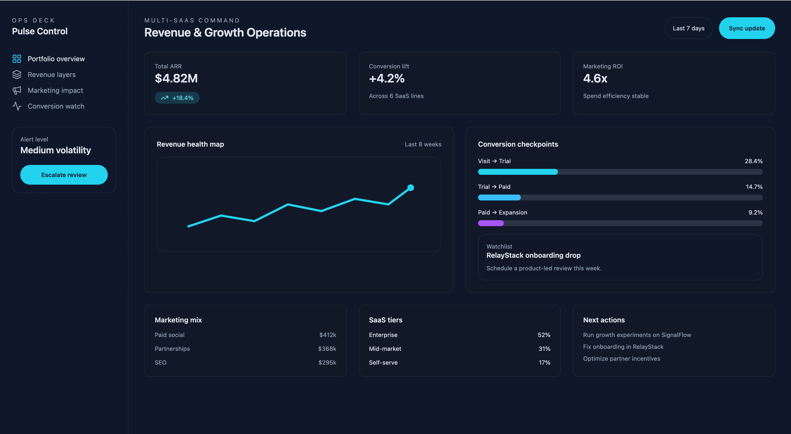
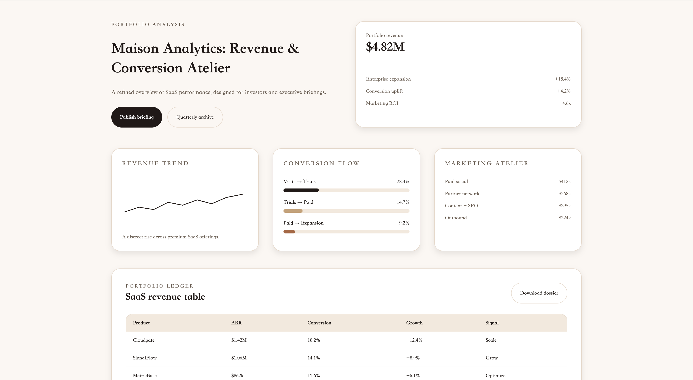
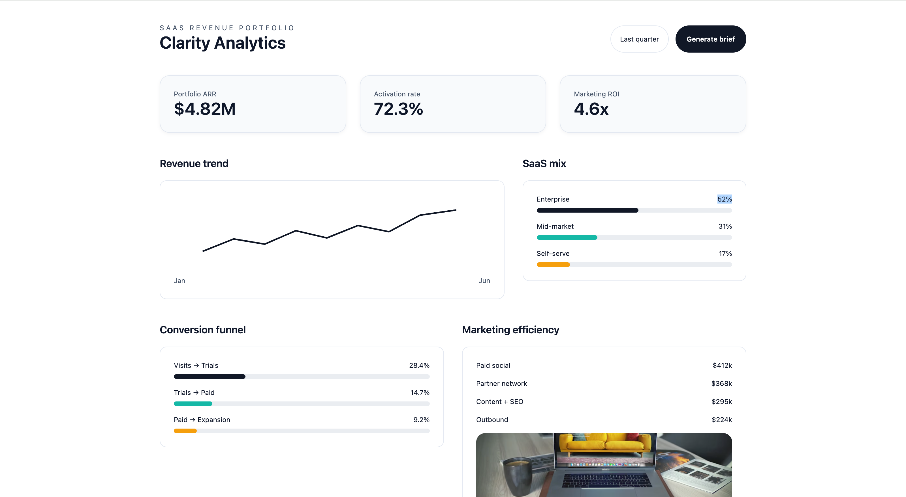

# Super Design Skill

[中文](README.zh-CN.md) | [English](README.md)

Super Design Skill is a high‑fidelity UI design workflow with autonomous exploration. It generates multiple distinct layout and style directions so you can choose by intuition without needing design jargon or deep design expertise.



No design terms required. The agent studies your product context and automatically explores the most suitable layout systems, color palettes, and visual directions. You simply pick the version you like and let it carry the rest of the project.

## Why it exists
- You need real, production‑grade UI directions fast.
- You want multiple layout + style options, not minor variants.
- You prefer clear outputs, repeatable flow, and a single board view.

## Showcase
These screens are generated from the same brief but intentionally explore different layout systems, density, and visual tone.






## What you get
- Autonomous exploration of **distinct** layout and visual directions.
- A decision‑ready first page: multiple directions to pick from.
- Consistent file structure with clear naming.
- A local board to review and compare everything in one place.
- High‑fidelity rules for spacing, imagery, icons, and motion.

## How the workflow works
1) **Structure intent**
   Map page goals and information hierarchy first (internal step).
2) **Exploration set**
   The first page is generated in **4 distinct styles**. If no light/dark preference is provided, it defaults to **2 light + 2 dark**. When users specify constraints, the skill still explores additional contrasting directions and explains why.
3) **Motion system**
   Define micro‑interaction rules consistent with the chosen direction.
4) **HTML outputs**
   Each direction is shipped as a real HTML page for preview.
5) **Board review**
   Use the board to compare and select a direction.
6) **Single direction delivery**
   Once selected, all remaining pages follow that direction.

Full details live in `references/workflow.md`.

## Quick start
1) Place this folder under your Codex `skills` directory (example: `~/.codex/skills/super-design`).
2) Use the skill name: `super-design`.
3) After HTML is generated, start the board:
   - `./.superdesign/design_iterations/start_board.sh`
4) Open the local URL printed in the terminal.
5) If you use the runbook commands, replace `<SKILL_DIR>` and `<PROJECT_ROOT>` with your local paths.

## Output structure
```
.superdesign/
├─ design_iterations/
│  ├─ {page_slug}_{style_name}_1.html
│  ├─ {page_slug}_{style_name}_2.html
│  ├─ {page_slug}_{style_name}_3.html
│  ├─ {page_slug}_{style_name}_{n}.html
│  └─ start_board.sh
└─ themes/
   └─ {project_slug}_{style_name}.css
```

Slug rules:
- lowercase ASCII only
- spaces replaced by `-`
- keep letters, numbers, and `-`

## Board
The board script lives at `/.superdesign/design_iterations/start_board.sh`.
If it is missing, copy the template from `scripts/start_board.sh`.

## High‑fidelity rules
- **Images**: use real open‑source images (Unsplash, Pexels, etc.).
- **Icons**: use real icons from open‑source icon libraries, no placeholders.
- **Spacing**: 4pt/8pt grid; touch targets ≥ 48px.
- **Motion**: subtle hover/press/focus feedback; keep durations under ~200ms.
- **No emoji**: keep UI language professional and product‑ready.

## License & attribution
This is a derivative work of **Superdesign**.
- Upstream: `https://github.com/superdesigndev/superdesign`
- License: AGPLv3. Files marked `/* @license Enterprise */` are under the Enterprise commercial license.

See `LICENSE` and `NOTICE.md` for details.

## Contributing
Issues and pull requests are welcome. Contributions must comply with the license.
