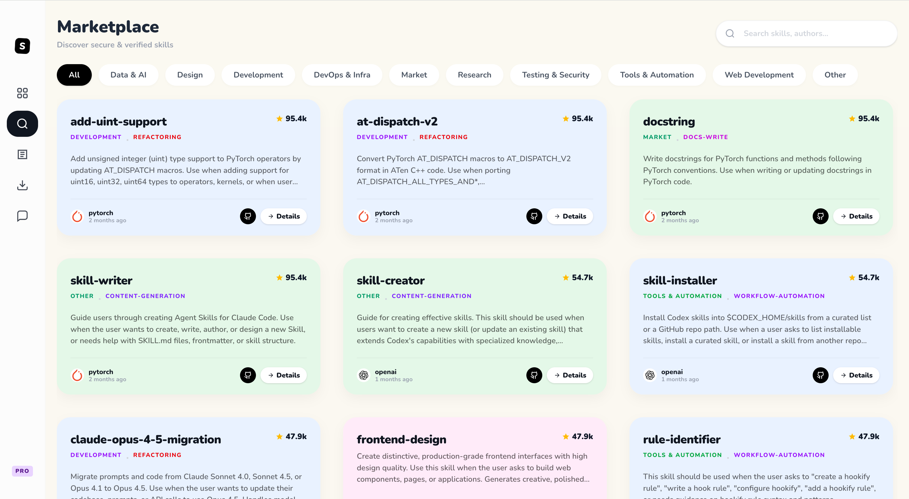
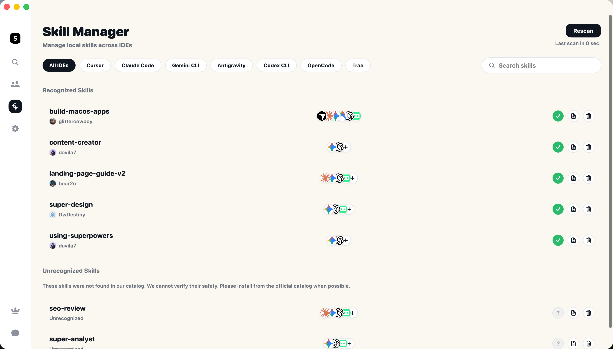

# Super Design Skill

[中文](README.zh-CN.md) | [English](README.md)

Super Design Skill is a high‑fidelity UI design workflow with autonomous exploration. It first explores structure skeletons in a neutral style, then explores multiple themes on the chosen skeleton so you can choose by intuition without needing design jargon or deep design expertise.


No design terms required. The agent studies your product context, proposes multiple skeletons, and then expands the chosen skeleton into distinct themes. You simply pick the version you like and let it carry the rest of the project across web, app, and mobile surfaces.

## Why it exists
- You need real, production‑grade UI directions fast.
- You want multiple layout + style options, not minor variants.
- You prefer clear outputs, repeatable flow, and a single board view.

## Showcase
These screens are generated from the same brief but intentionally explore different layout systems, density, and visual tone.


## What you get
- Autonomous exploration of **distinct skeletons** first, then **distinct themes**.
- A decision‑ready first page: pick a skeleton, then pick a theme.
- Consistent file structure with clear naming.
- A local board to review and compare everything in one place.
- High‑fidelity rules for spacing, imagery, icons, and motion.

## How the workflow works
1) **Business understanding**
   Extract goals, user flows, and content requirements (internal step).
2) **Skeleton exploration**
   Generate multiple full HTML skeletons in a neutral style and compare in the board.
3) **Skeleton selection**
   Pick the structure that best fits the product.
4) **Theme exploration**
   Keep the skeleton fixed and explore multiple distinct themes.
5) **Theme selection**
   Pick the preferred visual language.
6) **Motion system**
   Define micro‑interaction rules aligned to the chosen theme.
7) **Single direction delivery**
   Once selected, all remaining pages follow the chosen skeleton + theme.

Full details live in `skill/references/workflow.md`.

## Installation & quick start
Install and launch from Skillmaps. It also provides the Skillmap Pro app for one‑click installation to Trae, Cursor, Antigravity, Opencode, Gemini CLI, Codex, and Claude Code.

[Skillmaps: Super Design](https://skillmaps.net/detail?id=DwDestiny-super-design-main-1769667338)




## Output structure
```
.superdesign/
├─ design_iterations/
│  ├─ {page_slug}_{style_name}_1.html
│  ├─ {page_slug}_{style_name}_2.html
│  ├─ {page_slug}_{style_name}_3.html
│  ├─ {page_slug}_{style_name}_{n}.html
│  └─ start_board.sh
└─ themes/
   └─ {project_slug}_{style_name}.css
```

Slug rules:
- lowercase ASCII only
- spaces replaced by `-`
- keep letters, numbers, and `-`

## Board
The board script lives at `/.superdesign/design_iterations/start_board.sh`.
If it is missing, copy the template from `skill/scripts/start_board.sh`.

## High‑fidelity rules
- **Images**: use real open‑source images (Unsplash, Pexels, etc.).
- **Icons**: use real icons from open‑source icon libraries, no placeholders.
- **Spacing**: 4pt/8pt grid; touch targets ≥ 48px.
- **Motion**: subtle hover/press/focus feedback; keep durations under ~200ms.
- **No emoji**: keep UI language professional and product‑ready.

## License & attribution
This is a derivative work of **Superdesign**.
- Upstream: `https://github.com/superdesigndev/superdesign`
- License: AGPLv3. Files marked `/* @license Enterprise */` are under the Enterprise commercial license.

See `LICENSE` and `NOTICE.md` for details.

## Contributing
Issues and pull requests are welcome. Contributions must comply with the license.
